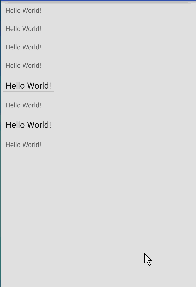

# AutoHideIME

## 快速实现收缩键盘

在实际项目中是不是有很多这样的需求：点击屏幕中除EditText任意位置收缩键盘。

遇到这样的需求是不是总是很无奈？

AutoHideIME帮助你快速实现这样的需求。

## 效果展示



## 如何使用

android studio用户在gradle配置中加入：

``` java
compile 'org.loader:autohideime:1.0'
```

在Activity中使用， 仅仅一句话就可以搞定：

``` java
public class MainActivity extends AppCompatActivity {

    @Override
    protected void onCreate(Bundle savedInstanceState) {
        super.onCreate(savedInstanceState);
        setContentView(R.layout.activity_main);
        HideIMEUtil.wrap(this);
    }
}
```

在Fragment中使用， 依然一句话：

``` java
public class MyFragment extends Fragment {

    @Nullable
    @Override
    public View onCreateView(LayoutInflater inflater, @Nullable ViewGroup container, @Nullable Bundle savedInstanceState) {
        return super.onCreateView(inflater, container, savedInstanceState);
    }

    @Override
    public void onViewCreated(View view, @Nullable Bundle savedInstanceState) {
        super.onViewCreated(view, savedInstanceState);
        HideIMEUtil.wrap(this);
    }
}
```
